# Studio Map

> The pantheon does not replace Mark. It multiplies him.

The studio runs on the **Olympus Model**: a hierarchy of AI agents organised as gods and household members, each with a defined domain. Mark holds three gates no god may open alone. Everything else is delegated.

Full founding document: [[Pantheon]]

---

## The Prime Laws

| # | Law | In one line |
|---|-----|-------------|
| I | Law of Scope | Gods stay in domain. When a task falls outside, they pass — not improvise. |
| II | Law of Voice | All output sounds like one studio. The Copywriter is the keeper. |
| III | Law of the Gate | Mark holds: **proposal gate · delivery gate · financial gate**. Gods prepare. Mark decides. |
| IV | Law of Memory | Nothing learned dies with the project. Write to Mnemosyne. |
| V | Law of Harvest | Every closed project yields: blog post · case study · testimonial. Non-optional. |
| VI | Law of the Signal | Notable moments go to Iris. She decides whether to broadcast. |
| VII | Law of Margin | No proposal leaves without Plutus's blessing. Beauty without margin is charity. |

---

## Architecture

```mermaid
graph TD
    MARK["⚡ MARK\n─────────────────────\nProposal Gate · Delivery Gate · Financial Gate"]

    MARK --> H
    MARK --> A
    MARK --> AP
    MARK --> HEP
    MARK --> T
    MARK --> I
    MARK --> P

    H["🔵 HERMES\nCoordinator · Flow · Triage · Comms\n/triage · /studio-startup · /recap · sync.py"]
    H --> H1["Autolycus — Triage Clerk"]
    H --> H2["Abderus — Scheduler · /abderus"]

    A["🟡 ATHENA\nStrategy · Qualification · Proposals\n/athena · /commission · /review-spec"]
    A --> A1["Pallas — Researcher · /pallas"]
    A --> A2["Nike — Proposal Writer · /nike"]
    A --> A3["Erichthonius — Estimator · /erichthonius\n⚠ also claimed by Hephaestus"]

    AP["🌸 APHRODITE\nVisual Design · Brand · Pre-QA Gate\n/aphrodite"]
    AP --> AP1["Harmonia — Layout · /harmonia"]
    AP --> AP2["Anteros — Brand Guardian · /anteros"]

    HEP["⚒ HEPHAESTUS\nBuild · WordPress · React · Infra\n/hephaestus · /scaffold-dir"]
    HEP --> HEP1["Caeculus — Frontend · /caeculus"]
    HEP --> HEP2["Periphetes — DevOps · /periphetes"]
    HEP --> A3

    T["⚖ THEMIS\nQA · Accessibility · Scope · Performance\n/themis · /qa · /studio-delivery-gate"]
    T --> T1["Eunomia — Scope Checker · /eunomia"]
    T --> T2["Dike — Accessibility · /dike"]
    T --> T3["Eirene — Performance · /eirene"]

    I["🌈 IRIS\nSocial · Event Broadcasting\n/iris"]
    I --> I1["Arke — Event Spotter · /arke"]
    I --> I2["Aura — Post Writer · /aura"]
    I --> I3["Kairos — Scheduler · /kairos"]

    P["💰 PLUTUS\nFinance · Invoicing · Tax · Cashflow\n/plutus · /harvest"]
    P --> P1["Poros — Invoicer · /poros"]
    P --> P2["Euporia — Tax Prep · /euporia"]
    P --> P3["Penia — Cashflow · /penia"]

    UTIL["🔧 SHARED UTILITIES\nCopywriter · Mnemosyne · Memory\nWeb Researcher · Notifier"]

    H & A & AP & HEP & T & I & P --> UTIL
```



---

## Build Status

### Gods

| God | Domain | Skill | Doc | Notes |
|-----|--------|-------|-----|-------|
| Hermes | Coordinator | `/hermes` (via studio-pm agent) | [[hermes/sync]] | Core loop built. Mirrors, sync.py, triage |
| Athena | Strategy | `/athena` | [[athena/athena]] | Qualification + proposal flow live |
| Aphrodite | Design | `/aphrodite` | [[aphrodite/aphrodite]] | Visual gate skill built |
| Hephaestus | Build | `/hephaestus` | [[hephaestus/hephaestus]] | WP/React planning skill built |
| Themis | QA | `/themis` · `/qa` | [[themis/themis]] | QA workflow + delivery gate built |
| Iris | Social | `/iris` | [[iris/iris]] | Broadcast skills built |
| Plutus | Finance | `/plutus` | [[plutus/plutus]] | Finance + harvest skills built |

### Household members

| Member | God | Skill | Status |
|--------|-----|-------|--------|
| Autolycus | Hermes | `/triage` | ✓ Built |
| Abderus | Hermes | `/abderus` | ✓ Built — timing sweep |
| Pallas | Athena | `/pallas` | ✓ Built |
| Nike | Athena | `/nike` | ✓ Built |
| Erichthonius | Athena + Hephaestus | `/erichthonius` | ✓ Built |
| Harmonia | Aphrodite | `/harmonia` | ✓ Built |
| Anteros | Aphrodite | `/anteros` | ✓ Built |
| Caeculus | Hephaestus | `/caeculus` | ✓ Built |
| Periphetes | Hephaestus | `/periphetes` | ✓ Built |
| Eunomia | Themis | `/eunomia` | ✓ Built |
| Dike | Themis | `/dike` | ✓ Built |
| Eirene | Themis | `/eirene` | ✓ Built |
| Arke | Iris | `/arke` | ✓ Built |
| Aura | Iris | `/aura` | ✓ Built |
| Kairos | Iris | `/kairos` | ✓ Built |
| Poros | Plutus | `/poros` | ✓ Built |
| Euporia | Plutus | `/euporia` | ✓ Built |
| Penia | Plutus | `/penia` | ✓ Built |

### Shared utilities

| Utility        | Implementation                                               | Status                           |
| -------------- | ------------------------------------------------------------ | -------------------------------- |
| Copywriter     | `/copywriter` skill                                          | ✓ Built                          |
| Mnemosyne      | `mnemosyne` agent · `context/portfolio/project-database.csv` | ✓ Built                          |
| The Memory     | Auto-memory system in `~/.claude/projects/…/memory/`         | ✓ Built                          |
| Web Researcher | `/web-researcher` skill                                      | ✓ Built                          |
| Notifier       | `studio/notifier.py` · Slack webhook                         | ✓ Built — [[utilities/notifier]] |

---

## Active Projects

See [[projects.base]] for the live project index. Individual project files in `docs/projects/`:

- [[projects/bstd]] — Bain Studio (internal tooling)
- [[projects/mcf]] — Mhairi McFarlane (Astro.js author site)
- [[projects/pipe]] — Upwork Pipeline (internal BizDev)
- [[projects/nore]] — The Nature of Real Estate (WordPress/MemberPress)

Plutus and Iris capabilities are **studio-wide** — not per-project enrollments.

---

## Project Lifecycle (14 stations)

```
SIGNAL → QUALIFICATION → ESTIMATION → PRICING → [PROPOSAL GATE]
→ BRIEF INTAKE → STRATEGY → DESIGN → BUILD → REVIEW
→ [DELIVERY GATE] → DELIVERY → HARVEST → CLOSURE
```

| Gate | Held by | What triggers it |
|------|---------|-----------------|
| Proposal gate | Mark | Athena + Plutus complete scope + margin check |
| Delivery gate | Mark | Themis signs off QA |
| Financial gate | Mark | Poros raises invoice |

---

## Key Files & Entry Points

| Purpose | Path |
|---------|------|
| Founding doc | `docs/Pantheon.md` |
| Architecture decisions | `docs/adr/` |
| God docs | `docs/gods/{name}/` |
| Shared utility docs | `docs/utilities/` |
| Sync script | `studio/sync.py` |
| Project registry | `studio/projects.json` |
| Asana mirror | `.claude/asana-mirror.md` |
| Notifier | `studio/notifier.py` |
| Project database | `~/Dropbox/Studio/context/portfolio/project-database.csv` |
| Studio skills | `.claude/skills/` (symlinked to `~/.claude/skills/`) |
| Studio memory | `~/.claude/projects/-media-data-dev-bain-studio/memory/` |

---

## The Olympus Oath

*I serve the studio's reputation before the client's comfort.*
*I serve the client's outcome before the project's convenience.*
*I serve the project's clarity before my own assumptions.*
*I do not act outside my domain.*
*I do not send without a gate.*
*I do not forget.*
*I pass the voice through the Copywriter.*
*I write to Mnemosyne.*
*I notify Mark.*
